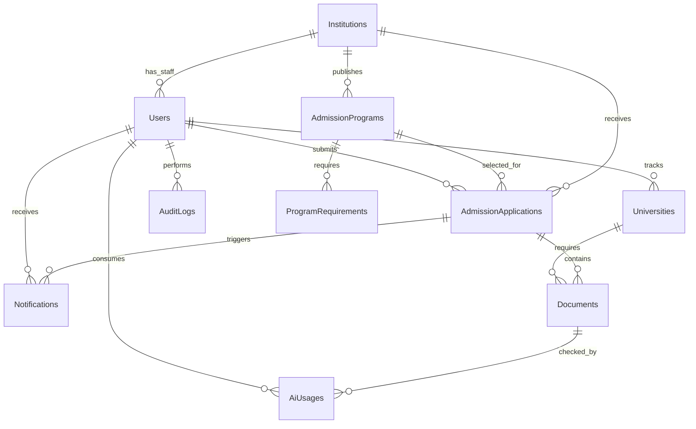

# Modelul bazei de date

UniTrack folosește o bază de date relațională administrată prin Sequelize. În dezvoltare se folosește SQLite local, iar în producție se recomandă PostgreSQL.

## Tabele principale

| Tabel | Rol |
| --- | --- |
| `Users` | conturi student, universitate și administrator |
| `Institutions` | instituții/universități administrate în sistem |
| `AdmissionPrograms` | oferta educațională oficială pe an academic |
| `ProgramRequirements` | documentele cerute de fiecare program |
| `Universities` | opțiunile urmărite de un student |
| `AdmissionApplications` | aplicații trimise de studenți către instituții |
| `Documents` | documente asociate unei opțiuni sau unei aplicații |
| `AiUsages` | jurnal de consum AI pentru limite și cost control |
| `Notifications` | notificări interne pentru utilizatori |
| `AuditLogs` | jurnal pentru acțiuni sensibile |

## Relații



## Constrângeri importante

- `Users.email` este unic.
- `Users.cnpHash` este unic pentru a permite un singur cont per CNP.
- CNP-ul nu este salvat în clar; se păstrează doar hash-ul și ultimele 4 cifre.
- O aplicație este unică pe combinația `StudentId + InstitutionId + program`.
- O aplicație poate fi legată de `AdmissionProgramId`, astfel încât elevul alege din oferta oficială, nu introduce liber facultăți.
- Cerințele documentare se generează din `ProgramRequirements`; dacă un program nu are cerințe configurate, backend-ul folosește setul standard.
- Documentele pot aparține fie unei opțiuni urmărite (`UniversityId`), fie unei aplicații trimise (`AdmissionApplicationId`).
- `AiUsages` permite limită zilnică pentru verificări documente și consilier AI, ca să protejeze cheia Gemini/OpenAI.

## Statusuri

### Utilizatori

```text
student | university | admin
```

### Instituții

```text
active | pending | disabled
```

### Programe

```text
licenta | master | doctorat
```

### Opțiuni urmărite

```text
Wishlist | Cercetare | Aplicat | Acceptat | Respins
```

### Aplicații trimise

```text
draft | submitted | under_review | accepted | rejected | waitlist
```

### Verificare documente

```text
missing | pending | verified | rejected
```

## PostgreSQL și RLS

Pentru producție, backend-ul se conectează la PostgreSQL prin:

```env
DB_DIALECT=postgres
DATABASE_URL=postgresql://...
```

După ce aplicația creează tabelele, politicile Row Level Security se aplică prin:

```bash
npm run db:sync --prefix backend
npm run db:rls --prefix backend
```

`db:sync` creează tabelele prin Sequelize, iar `db:rls` aplică politicile de securitate. Scriptul SQL folosit este:

```text
backend/sql/postgres_rls.sql
```

Verificarea conexiunii și a tabelelor principale:

```bash
npm run production:check --prefix backend
```

## Date locale

Baza SQLite locală este generată automat în:

```text
backend/data/unitracka.sqlite
```

Acest fișier este ignorat de Git. În repository se păstrează schema prin cod, scripturile SQL și documentația, nu datele locale.
